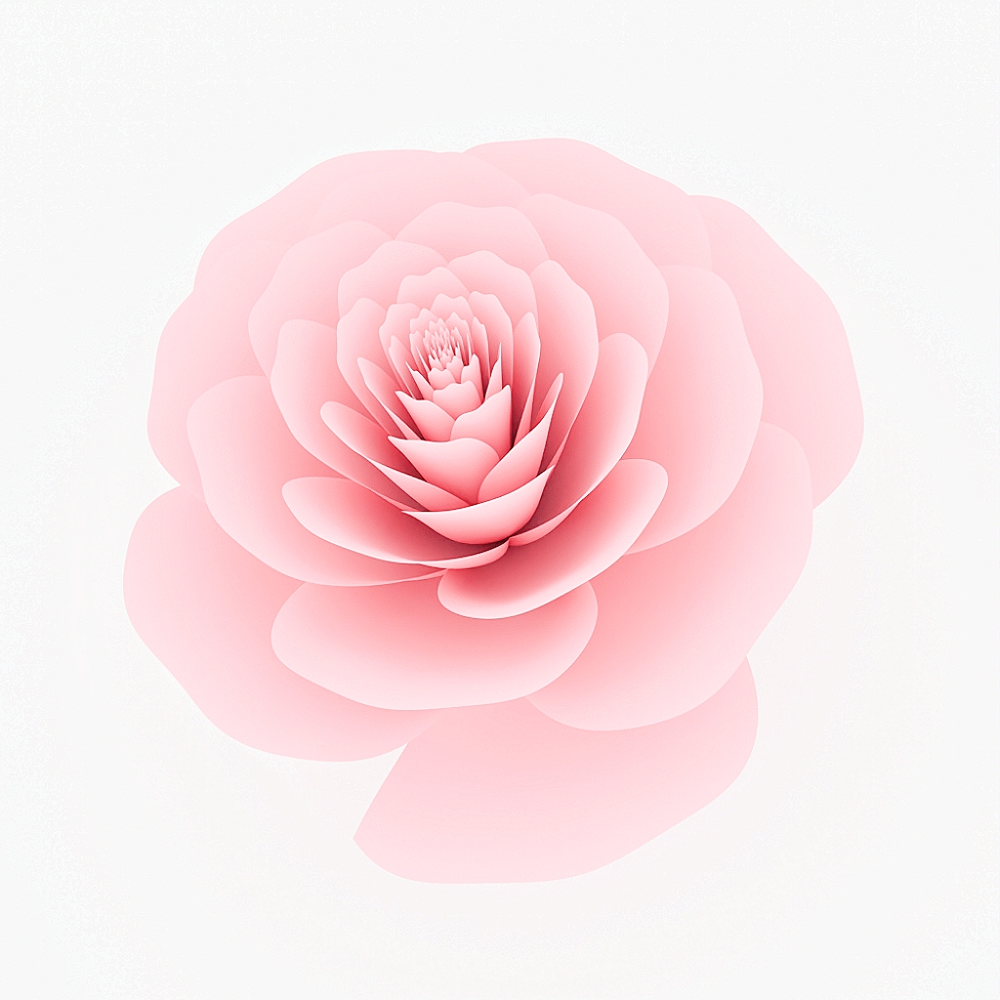

# Geometric_Construction

[TOC]

## Introduction

***Implicit Equation | Camellia***: 

### System Overview

### System Objectives

## System Architecture

### Core Components Detailed

The system supports various geometric shapes:
| Shape                                        |                          Expression                          |
| :------------------------------------------- | :----------------------------------------------------------: |
| ***Implicit Equation***                      |                    $f(\boldsymbol x) = 0$                    |
| ***Parametric Equation***                    |                 $f: (u, v) \to \mathbb R^3$                  |

### Workflow

### Module Descriptions

### Technical Features

## Usage Instructions

### Environment Requirements

- Go 1.23.0
- Python 3.x (for visualization)

### Scene Script Format

### Building and Running

### Visualization Interface

### Development Guide

#### Performance Optimization

## TODO
