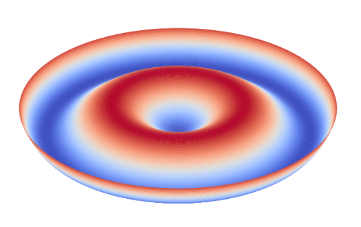
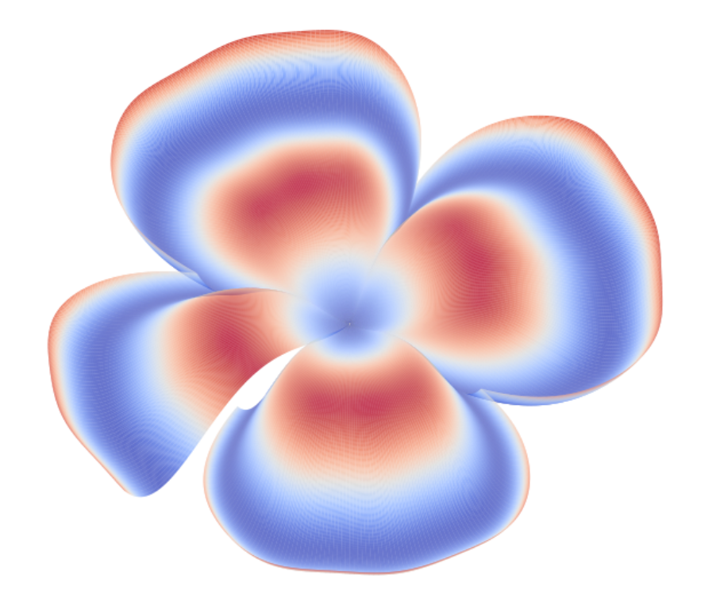
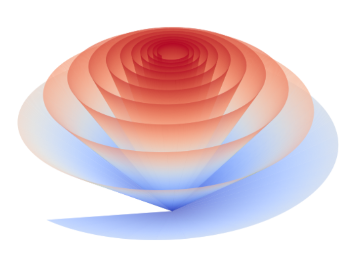
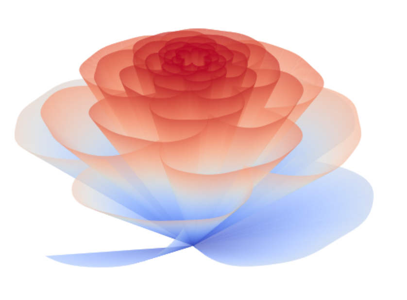
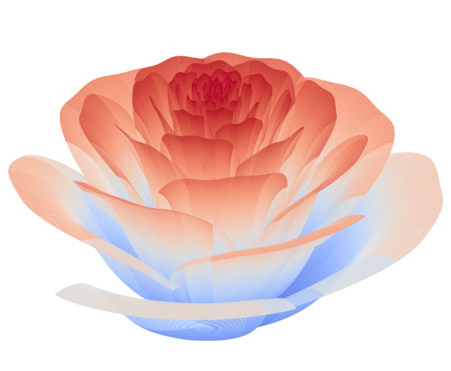
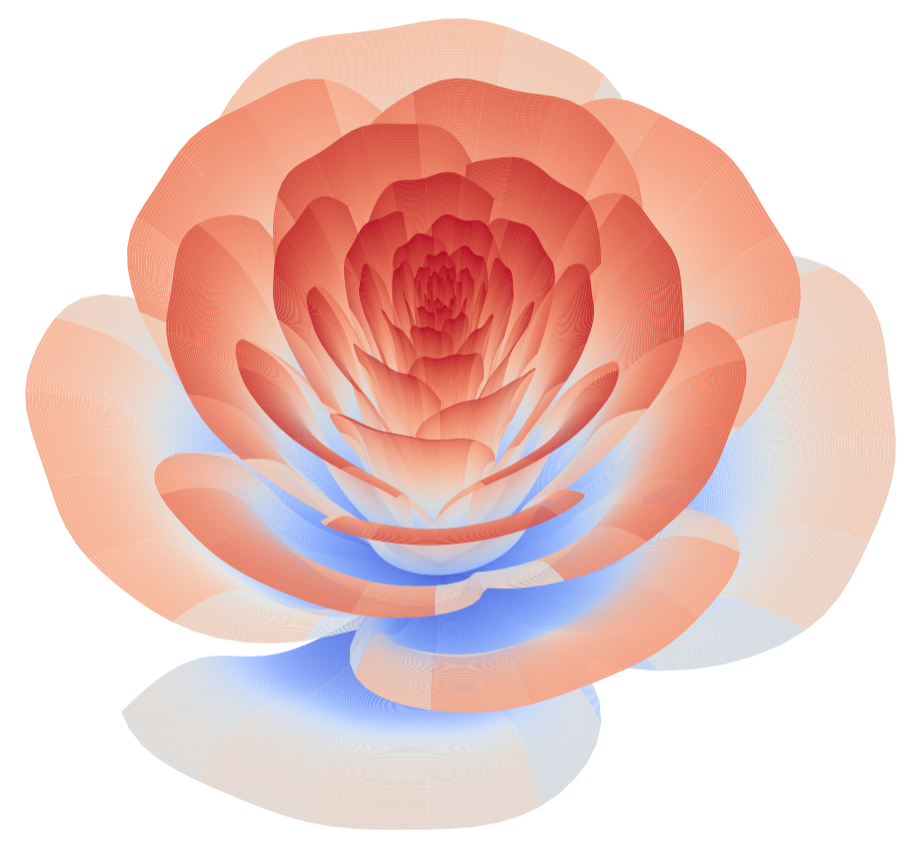

# Camellia

$$
\begin{align*}
(r, \theta) &\in ([0, 1], [4\pi, 24 \pi])  \tag{参数空间}\\
edge(\theta) &= 1-\frac{1}{2}\left(1-\frac{\mod(3.6 \theta, 2\pi)}{\pi}\right)^4 + disturb(\theta)   \tag{花边}\\
disturb(\theta) &= \frac{\sin(15 \theta)}{150}   \tag{花边扰动}\\
f_2(r)&=2(r^2-r)^2 \tag{花瓣弧面}\\
\alpha(\theta) &= \frac{\pi}{2} \cdot e^{-\frac{\theta}{8\pi}}  \tag{倾斜角衰减}\\
h(r,\theta)&=f_2(r) \sin(\alpha(\theta))  \tag{弧面衰减}\\
\left(\begin{matrix}R\\ H\end{matrix}\right) &= \left(\begin{matrix}\sin\alpha(\theta) & \cos\alpha(\theta) \\ \cos\alpha(\theta) & -\sin\alpha(\theta) \end{matrix}\right) \left(\begin{matrix}r\\  h(r,\theta)\end{matrix}\right) \tag{旋转矩阵}\\
\left(\begin{matrix}X\\ Y\\ Z\end{matrix}\right) &= \left(\begin{matrix}edge(\theta) \cdot R \cos\theta\\ edge(\theta) \cdot R \sin\theta\\  edge(\theta) \cdot H\end{matrix}\right)  \tag{3D欧式空间映射}
\end{align*}
$$

## 花边

**花边**: 控制花瓣的径向膨胀与收缩，形成层叠结构。周期性对应花瓣数量，3.6的系数使得每圈（$2\pi$）约生成$3.6/(2\pi) \times 2\pi \approx 3.6$个主瓣，实际因四次方作用可能显更多细节。

- $\text{mod}(3.6\theta, 2\pi)$生成周期为$2\pi/3.6 \approx 1.745$的锯齿波。
- $\frac{\text{mod}(3.6t, 2\pi)}{\pi} \in [0, 2)$，再通过$1 - \cdot$翻转并偏移到$(-1, 1]$。

- $\left(\cdot\right)^4$增强波峰/波谷对比，除以2后范围压缩到$[0, 0.5]$，整体$u(t) \in [0.5, 1.5]$波动。

- $\text{disturb}(\theta)$ 引入高频（周期$2\pi/15 \approx 0.42$）、低幅（$\pm 1/150$）扰动。

## 花瓣弧面

控制花瓣弧面: $f(x) = 2(r^2 - r)^2$ $2(r^2-r)^2$ 在 $r=0$ 和 $r=1$ 处为0，在$r=0.5$ 处达最大值 $0.5$，形成中间隆起的截面形状。乘上衰减项 $\sin(p(\theta))$ 随$\theta$增大而减小，使外层花瓣的垂直起伏减弱，逐渐平展

## 花瓣层叠

**倾斜角**: $\frac{\pi}{2} \cdot e^{-\frac{\theta}{8\pi}}$: 控制花瓣的倾斜角随旋转角度 $\theta$ 指数衰减。初始较大的倾斜角（$\pi/2$）使花瓣在花心处直立，随$t$增大（向外旋转），角度减小，花瓣逐渐平展。

**花瓣旋转**: 将局部坐标$(x, y)$绕原点旋转角度$\alpha(\theta)$，再缩放$edge(\theta)$倍。旋转使花瓣随$\theta$增加逐渐由直立转为倾斜，模拟自然花瓣的层叠生长。缩放因子$edge(\theta)$增强外层的扩展，形成绽放效果。

